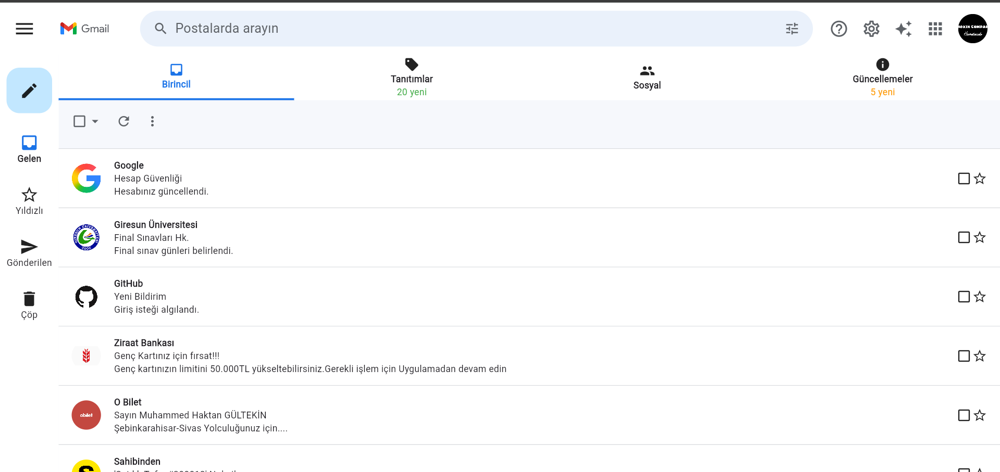
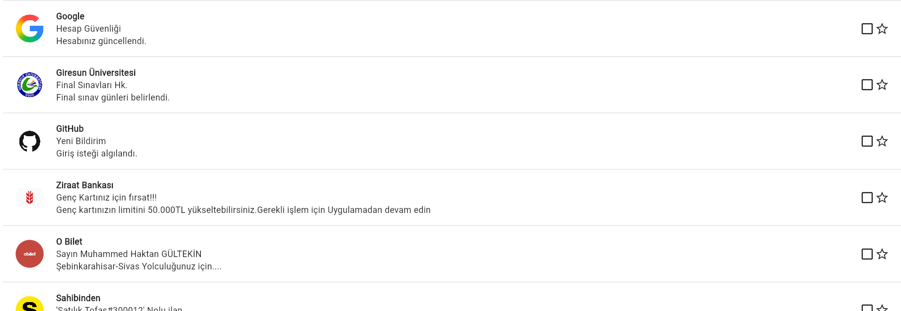

# Gmail Klonu

## Klonlanan Uygulama

Bu projede Google Gmail uygulamasının masaüstü arayüzünü Flutter kullanarak yapmaya çalışıldı. Amaç Gmail görünümüne benzer bir tasarım oluşturmaktı.

## Kullanılan Teknolojiler

* Flutter 3.44.0
* Dart 3.12.0
* Visual Studio Code

## Kullanılan Widget'lar

### Yapısal Widget'lar

* MaterialApp
* Scaffold

### Düzen Widget'ları

* Column
* Row
* Expanded
* ListView
* Spacer

### İçerik Widget'ları

* Text
* Image
* Icon

### Stil Widget'ları

* Container
* SizedBox

### Görsel Düzenleme Yapıları

* BoxDecoration
* DecorationImage
* NetworkImage
* BorderRadius

## Proje Hakkında

Bu projede Flutter kullanarak Gmail uygulamasının arayüzünü oluşturdum. Uygulamada üst menü, arama çubuğu, sol tarafta menü alanı, mail kategorileri ve mail listesi bulunuyor.

## Ekran Görüntüleri

### Ana Ekran

### Mail Listesi

### Sol Menü

## Öğrenci Bilgileri

Ad Soyad: Muhammed Haktan GÜLTEKİN

Okul: Giresun Üniversitesi Şebinkarahisar Meslek Yüksekokulu

Bölüm: Bilişim Güvenliği Teknolojisi

Öğrenci No: 254602022

